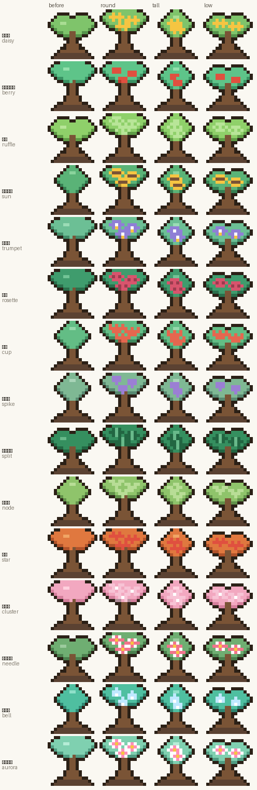
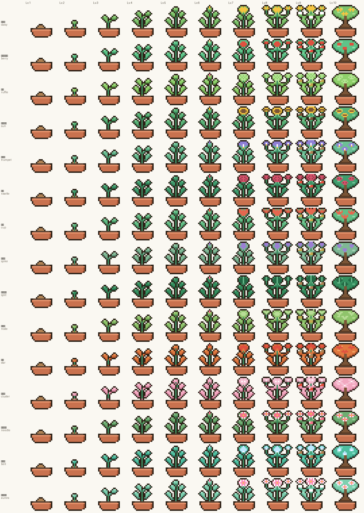

# TokenPlant

AI 코딩 토큰 사용량으로 식물을 키우는 macOS 메뉴바 앱.

**토큰을 쓰면 식물이 자란다.** 아무것도 안 눌러도, 앱을 안 열어도.
그리고 같은 토큰이 지갑에도 쌓여서, 거기서 물·거름·영양제를 사면 **더 빨리** 자란다.
거목이 되면 정원으로 이식되고 화분에는 새 씨앗이 심긴다.

<p align="center">
  
  <br>
  
</p>

## 설치

### Homebrew (권장)

```bash
brew install --cask YOUR-GITHUB-ID/tap/tokenplant
```

메뉴바 오른쪽에 화분이 뜨면 끝이다. 톱니 메뉴에서 **로그인 시 자동 실행**을 켜두면
재부팅해도 알아서 뜬다.

업데이트:

```bash
brew upgrade --cask tokenplant
```

### 직접 다운로드

[Releases](https://github.com/YOUR-GITHUB-ID/tokenplant/releases/latest) 에서
`TokenPlant.zip` 을 받아 압축을 풀고 `TokenPlant.app` 을 `/Applications` 로 끌어다 놓는다.

이 앱은 Apple 공증(notarization)을 받지 않았다. 그래서 첫 실행에 Gatekeeper 경고가 뜬다.
둘 중 하나로 넘긴다.

- Finder 에서 앱을 **우클릭 → 열기** (두 번 눌러야 할 수도 있다)
- 또는 터미널에서:

```bash
xattr -dr com.apple.quarantine /Applications/TokenPlant.app
```

Homebrew 로 깔면 이 과정이 자동으로 처리돼서 경고를 볼 일이 없다.

### 소스에서 빌드

```bash
git clone https://github.com/YOUR-GITHUB-ID/tokenplant.git
cd tokenplant
./build-app.sh --install
```

Swift 툴체인이 필요하다(Xcode 또는 `xcode-select --install`).
Apple Silicon·Intel 둘 다 담은 universal 바이너리로 만들고, 실패하면 이 기계 것만 만든다.

## 요구사항

- macOS 14 (Sonoma) 이상
- Claude Code 또는 Codex 를 쓰고 있을 것 — 그 로그가 물이 된다

## 무엇을 읽는가

성장에 쓰는 값은 전부 **이미 내 디스크에 있는 로그**에서 나온다. 30초마다 한 번,
증분으로만 읽는다.

| 읽는 것 | 무엇 때문에 |
|---|---|
| `~/.claude/projects/**/*.jsonl` | 메시지별 토큰 사용량 |
| `~/.codex/sessions/YYYY/MM/DD/*.jsonl` | 같음 |
| Keychain (Claude Code 가 넣어둔 OAuth 토큰) | 공식 한도 조회 — **선택** |

- 저장은 `~/Library/Application Support/TokenPlant/state.json` **한 파일**뿐이다.
- 네트워크는 **한 곳**만 탄다 — `api.anthropic.com/api/oauth/usage`. 내 한도 잔량을
  내 토큰으로 조회하는 것이고, 이 앱은 그 외에 아무 데도 접속하지 않는다.
  분석·수집·텔레메트리 없음.
- 대화 내용은 읽지 않는다. `message.usage` 의 **숫자만** 본다.
- 키체인 접근을 거절해도 성장은 그대로 돌아간다. 한도 창 보너스만 안 붙는다.

## 어떻게 자라나

```
                ┌─▶ 가중 환산 mL ──▶ 화분이 저절로 자란다
쓴 토큰 ────────┤
                └─▶ 원시 토큰 ────▶ 지갑 · 물 / 거름 / 영양제를 산다 ─▶ 가속

씨앗 → 발아 → 떡잎 → 어린잎 → 자란 줄기 → 꽃봉오리 → 첫 꽃 → 만개 → 열매 → 거목
창가 0 → 베란다 1 → 작은 화단 3 → 뒷마당 6 → 온실 10 → 수목원 18 → 비밀의 숲 30 (그루)
```

두 물길은 **서로 뺏지 않는다.** 아이템을 사도 이미 자란 건 줄지 않고,
안 사도 화분은 계속 찬다. 다 자라는 데 걸리는 목표치는 심을 때 그 사람의 실제
사용량에 맞춰 정해진다 — 아무것도 안 사면 약 4주, 아이템을 잘 쓰면 2주쯤.

지갑은 **설치 후 계속 누적**되고 자정에 초기화되지 않는다. 다만 시간이 아니라
토큰을 써야 늘어난다. 값은 "며칠치"로 매겨져 있고, 하루치가 얼마인지는 앱이 직접 잰다.

설치하면 **씨앗부터** 시작한다. 설치 전에 쓴 토큰은 소급하지 않는다 —
과거 로그는 "이 사람 하루가 얼마인가"를 재는 데만 쓰고, 성장과 지갑에는 안 들어간다.

숫자를 왜 그렇게 정했는지는 [DESIGN.md](DESIGN.md) 에 있다.

## 들어 있는 것

- **메뉴바** — 전용 16×16 단계 스프라이트 + 오늘 원시 토큰
- **홈** — 화분이 저절로 차는 게 주인공이고, 그 아래 지갑과 "지금 뭘 살 수 있나".
  물방울·거름 알갱이·단계 교차 페이드. 가방의 물·거름·영양제를 여기서 바로 쓴다.
  화분 슬롯을 사면 두 그루가 되고, **물은 양쪽에 똑같이** 들어간다
- **상점** — 11품목, 값은 원시 토큰. 모든 값에 **며칠치**가 붙고,
  부족분은 "하루 더 쓰면 / 2일 더 쓰면"으로, 거름·영양제는 같은 값으로 물을 샀을 때와
  견줘 이득인지 손해인지 실수치로 보여준다. 장식 뽑기는 12종을 중복 없이 모은다
- **가방** — 개수·지속 효과 남은 일수·씨앗 예약
- **컬렉션** — 정원 미니뷰 + 15종 도감 + 기록
- **정원 창** — 7티어 절차적 배경, 계절 팔레트, 그루 클릭 명패,
  장식 끌어서 자리 정하기, PNG 내보내기(18그루 해금)

## 개발

```bash
swift build
swift test           # 264개
swift run            # 번들 없이 바로 — 자동 실행 토글은 이때 안 보인다
```

`Core/` 는 Foundation 전용이라(AppKit·SwiftUI 없음) UI 없이 밸런스만 먼저 테스트할 수 있다.

### 컴파일러 없이 검증하기

`verify/` 는 Swift 툴체인이 없는 환경에서 쓰는 검사기다. 타입 검사는 못 하지만
리팩터로 반쪽만 지운 심볼과 밸런스 회귀는 여기서 잡힌다.

```bash
python3 verify/check_syntax.py .    # tree-sitter-swift 파싱
python3 verify/check_members.py .   # 없는 멤버 · 없는 case · 빠진 case
python3 verify/check_data.py        # 스프라이트 격자 · 가격표 양언어 일치 · 테스트 리터럴
python3 verify/run_tests.py         # 엔진 파이썬 포팅 + 단정 414개
python3 verify/make_icon.py         # 스프라이트 → Resources/AppIcon.icns
python3 verify/preview_species.py   # 종×단계 대조표 PNG — 픽셀아트는 보고 고쳐야 한다
python3 verify/gen_motifs.py --write  # 파이썬 모티프 → Swift 코드 생성
python3 verify/gen_decor.py --write   # 장식 스프라이트 → Swift 코드 생성
```

모티프와 장식은 **파이썬이 원본**이고 Swift 는 생성물이다. 픽셀아트는 보지 않고 고치면
반드시 망하는데 이 환경에선 Swift 를 컴파일할 수 없어서, 렌더해 보며 다듬고
확정된 것만 흘려보낸다. 둘이 어긋나면 `check_data.py` 가 잡는다.

아이콘도 손으로 그리지 않는다. `make_icon.py` 가 `PlantSprites.swift` 의 마지막 단계를
읽어 렌더하므로, 스프라이트를 고치면 아이콘이 따라온다.

### 릴리스

```bash
./build-app.sh --zip                 # dist/TokenPlant-<VERSION>.zip
shasum -a 256 dist/TokenPlant-*.zip  # cask 에 박을 체크섬
```

ad-hoc 서명은 빌드마다 신원이 바뀐다. 그래서 다시 빌드하면 한도 조회용 키체인 접근
허용을 **다시 물어본다**. 거절해도 성장은 그대로 돌아간다.

## 문서

- [DESIGN.md](DESIGN.md) — 숫자와 규칙을 왜 그렇게 정했는지
- [SPEC.md](SPEC.md) — 명세

## 라이선스

MIT. 자세한 내용은 [LICENSE](LICENSE).
