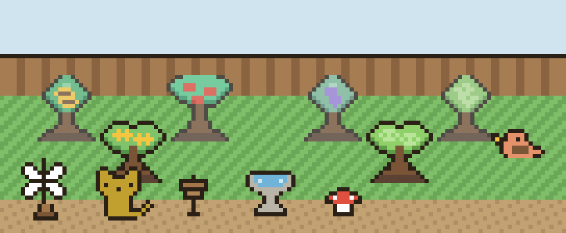
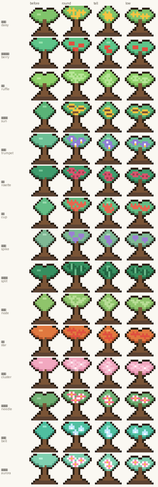
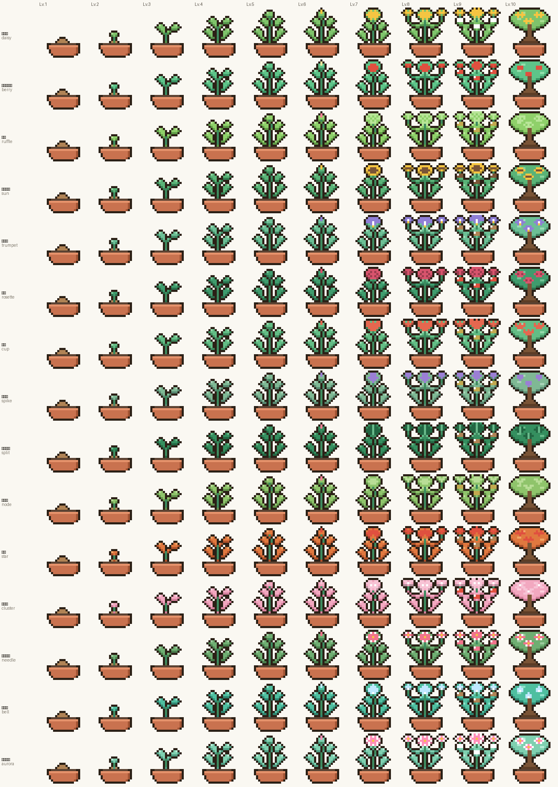

# TokenPlant

*[한국어](README.ko.md)*

A macOS menu bar app that grows a pixel-art plant from your AI coding token usage.

**Spend tokens, and the plant grows.** You don't press anything. You don't even open the app.
The same tokens also fill a wallet, and spending that on water, fertilizer and nutrient makes it grow **faster**.
Once it's fully grown it gets transplanted into your garden and a new seed goes into the pot.

Things you place in the garden **move**. A windmill turns, a cat flicks its tail, and if you put out
a feeder or a birdbath, a bird flies in and perches there.

<p align="center">
  
  <br>
  
  <br>
  
</p>

## Requirements

- macOS 14 (Sonoma) or later
- You use Claude Code or Codex — their logs are the water

> **It only counts CLI usage.** Claude Code and Codex write session logs to your disk; the web and
> desktop apps don't. If you mostly work in the browser there's nothing on disk to read, and your
> plant won't grow. I lost a day to this myself before working out that the app was reading
> correctly and there was simply nothing there.

## Install

### Homebrew (recommended)

```bash
brew install --cask seoyeon1123/tap/tokenplant
```

A pot shows up on the right of your menu bar and that's the whole setup. Turn on **Launch at login**
in the gear menu and it comes back after a reboot.

The app updates itself (Sparkle, once a day). To do it by hand:

```bash
brew upgrade --cask tokenplant
```

### Direct download

Grab `TokenPlant.zip` from [Releases](https://github.com/seoyeon1123/tokenplant/releases/latest),
unzip it, and drag `TokenPlant.app` into `/Applications`.

This app is not notarized by Apple, so the first launch trips Gatekeeper. Either:

- **Right-click → Open** in Finder (you may need to do it twice), or
- run:

```bash
xattr -dr com.apple.quarantine /Applications/TokenPlant.app
```

Homebrew handles this for you, which is why it's the recommended path.

### Build from source

```bash
git clone https://github.com/seoyeon1123/tokenplant.git
cd tokenplant
./build-app.sh --install
```

Needs a Swift toolchain (Xcode, or `xcode-select --install`). It builds a universal binary for
Apple Silicon and Intel, and falls back to this machine's architecture if that fails.

## What it reads

Everything that feeds growth comes from **logs already on your disk**, read incrementally once
every 30 seconds.

| What | Why |
|---|---|
| `~/.claude/projects/**/*.jsonl` | per-message token usage |
| `~/.codex/sessions/YYYY/MM/DD/*.jsonl` | same |
| Keychain (the OAuth token Claude Code stores) | official rate-limit lookup — **optional, off by default** |

- State lives in **one file**: `~/Library/Application Support/TokenPlant/state.json`
- It touches the network in exactly **one place** — `api.anthropic.com/api/oauth/usage`, to ask for
  your own rate limits with your own token. Nowhere else. No analytics, no telemetry, no account.
- It does not read your conversations. Only the **numbers** in `message.usage`.
- Decline the keychain prompt and growth carries on exactly the same. You just don't get the
  rate-limit window bonus.

## How it grows

```
                ┌─▶ weighted mL ──▶ the pot fills on its own
tokens spent ───┤
                └─▶ raw tokens ──▶ wallet · buy water / fertilizer / nutrient ─▶ speed-up

seed → sprout → cotyledon → young leaf → stem → bud → first bloom → full bloom → fruit → great tree
sill 0 → balcony 1 → flower bed 3 → backyard 6 → greenhouse 10 → arboretum 18 → secret forest 30 (trees)
```

The two streams **never take from each other**. Buying items doesn't shrink what already grew, and
not buying anything doesn't stall the pot. Roughly four weeks per plant if you buy nothing, about
two if you spend well.

The wallet **accumulates from install** and isn't reset at midnight. It grows with tokens, not with
time.

You start from a **seed** on install. Tokens you spent before installing aren't credited —
past logs are only used to measure what a day looks like for you.

## Why prices are measured in days, not tokens

This is the one balance decision worth spelling out.

Hardcoding thresholds ties the whole game to one person's usage. If a plant costs 300M tokens,
that's a month for someone burning 100M a day and a year and a half for someone burning 5M.
The second person isn't playing a slow game, they're playing a broken one, and they quit before
stage five.

So the target is **28 days**, and the token amount is derived from *your own* 14-day measured
average. Shop prices are all defined as multiples of a day too. Everyone gets about one plant a
month no matter how heavy a user they are. The upside is there's no difficulty slider to get wrong;
the downside is you can't speed the clock up.

Filling the garden (30 trees) takes about two years. That's deliberate — it isn't a game you grind,
it's a thing that's quietly bigger every few weeks.

The reasoning behind the rest of the numbers is in [DESIGN.md](DESIGN.md) *(Korean)*.

## What's in it

- **Menu bar** — a dedicated 16x16 sprite per stage, plus today's raw token count
- **Pot** — the pot filling by itself is the main event; under it, the wallet and what you can
  afford right now. Water droplets, fertilizer grains, cross-fades between stages. Buy a pot slot
  and you get two plants, and **water reaches both equally**
- **Shop** — 11 items priced in raw tokens. Every price also shows **how many days' worth** it is,
  shortfalls read as "one more day" / "two more days", and fertilizer and nutrient show whether
  they actually beat spending the same amount on plain water. 12 decorations: 3 sold directly,
  9 from a gacha box that never gives a duplicate
- **Storage** — counts, days left on active effects, reserved seeds
- **Streak gifts** — 3 / 7 / 14 / 30 consecutive days with token usage each give a decoration draw.
  It counts **days you spent tokens**, not days on the calendar, and one missed day restarts it
- **Collection** — garden mini-view, a 15-species dex, and a log
- **Garden window** — 7 procedurally drawn tiers, seasonal palettes, click a tree for its nameplate,
  drag decorations where you want them, PNG export (unlocked at 18 trees)

## Development

```bash
swift build
swift test           # 330 tests
swift run            # straight from source, no bundle — the launch-at-login toggle is hidden here
```

`Core/` is Foundation-only (no AppKit, no SwiftUI), so the balance can be tested without any UI.

### Verifying without a compiler

`verify/` holds checkers for environments with no Swift toolchain. They can't typecheck, but they
do catch half-deleted symbols after a refactor and balance regressions.

```bash
python3 verify/check_syntax.py .    # tree-sitter-swift parse
python3 verify/check_members.py .   # missing members · missing enum cases
python3 verify/check_data.py        # sprite grids · price table parity across both languages
python3 verify/run_tests.py         # engine ported to Python + 437 assertions
python3 verify/make_icon.py         # sprites → Resources/AppIcon.icns
python3 verify/preview_species.py   # species x stage contact sheet
python3 verify/gen_motifs.py --write  # Python motifs → generated Swift
python3 verify/gen_decor.py --write   # decoration sprites → generated Swift
```

Motifs and decorations are **authored in Python**; the Swift is generated. Pixel art has to be
*looked at* to be fixed, and in that environment Swift can't be compiled, so sprites are rendered
and tweaked as images and only the settled ones are emitted. If the two drift apart,
`check_data.py` catches it.

The app icon isn't hand-drawn either. `make_icon.py` renders the final stage out of
`PlantSprites.swift`, so fixing the sprite fixes the icon.

### Releasing

```bash
./build-app.sh --zip                 # dist/TokenPlant-<VERSION>.zip
shasum -a 256 dist/TokenPlant-*.zip  # checksum for the cask
```

Updates are signed with EdDSA and shipped through Sparkle — no Apple Developer ID required.
Ad-hoc signing gives the binary a new identity on every build, so a rebuilt copy asks for keychain
access again. Declining only costs you the rate-limit bonus.

## Docs

- [DESIGN.md](DESIGN.md) — why the numbers and rules are what they are *(Korean)*
- [SPEC.md](SPEC.md) — the spec *(Korean)*

## License

MIT. See [LICENSE](LICENSE).
